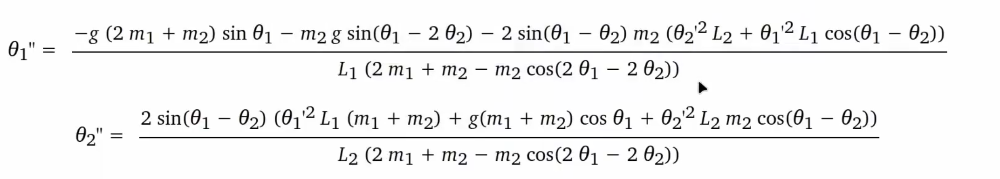

# 双摆模拟 (Double Pendulum)

参考 https://youtu.be/HQmhBtxuOog?si=thxjLji7jAYbc1v9  
基于 C + raylib 的双摆物理模拟，展示混沌系统对初始条件的敏感性。

## 概述

使用拉格朗日力学推导双摆的运动方程，通过半隐式 Euler 方法进行数值积分，在 144 FPS 下实时渲染。

## 构建

### 依赖

- CMake ≥ 3.16
- Ninja（或 make）
- GCC
- raylib 5.5（已内置在 `deps/` 目录）

### 编译 & 运行

```bash
cmake -B build -G Ninja
cmake --build build
./build/double-pendulum
```

## 数学公式



## 项目结构

```
.
├── CMakeLists.txt          # CMake 构建配置
├── README.md
├── deps/
│   └── raylib-5.5_linux_amd64/  # raylib 预编译库
├── include/                # 公共头文件（预留）
└── src/
    └── main.c              # 主程序（初始化、物理计算、渲染）
```
